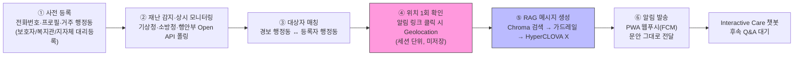
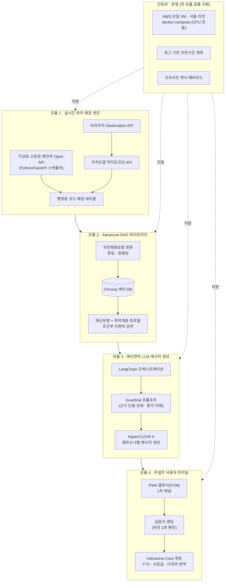
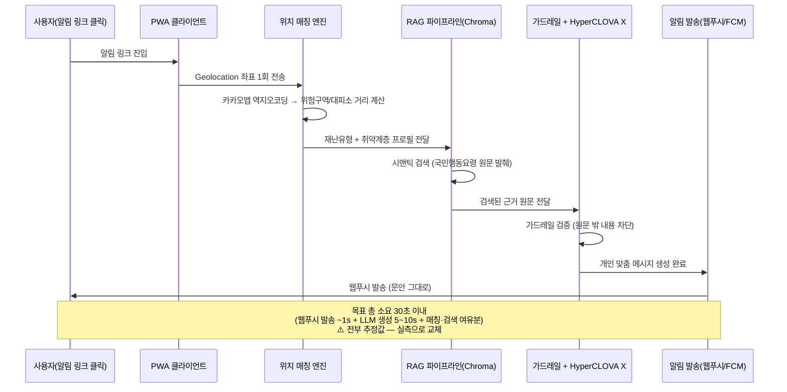
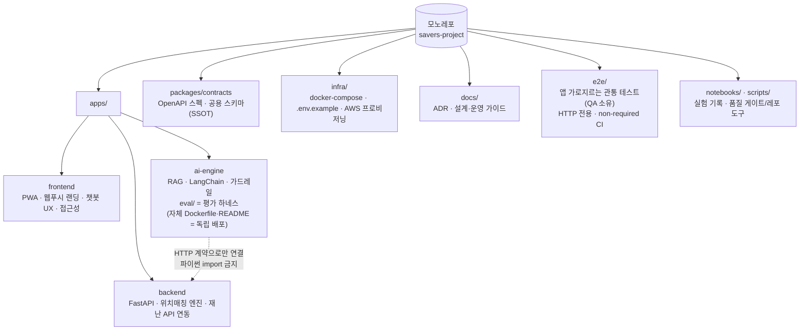

# 세이버스(SAVERS) 프로젝트 구조도

`AGENTS.md`, `개발자_가이드.md`, `리스크.md`, `구현_범위.md`에서 정리한 내용을 바탕으로 시스템 구조를 mermaid로 도식화한 문서입니다.

> ⚠️ **이 문서는 "무엇을 만들 것인가"(목표 아키텍처)입니다.** 지금 저장소에서 실제로 도는 것은
> 그 일부이며, 외부 의존은 전부 오프라인 스텁입니다. **"지금 무엇이 돌아가는가"는
> [워킹_스켈레톤_설명.md](워킹_스켈레톤_설명.md)** 에 모듈·함수 단위로 정리돼 있고, 각 단계를 직접
> 돌려 확인하는 절차는 [워킹_스켈레톤_점검.md](워킹_스켈레톤_점검.md)에 있습니다. 두 문서가
> 어긋나면 코드와 대조해 이 문서를 갱신하세요.
>
> 알림 채널은 [ADR-0005](../adr/0005-webpush-primary-channel.md)로 **PWA 웹푸시(FCM) 1차**가
> 확정됐습니다(카카오 알림톡은 예선 범위 제외). 아래 도식은 그 결정을 반영한 상태입니다.

## 1. 전체 파이프라인 (6단계)

경보 발생부터 개인 맞춤 알림 도달까지의 흐름입니다. 기획서의 "6단계 작동 파이프라인"을 그대로 반영했습니다.

> 목표: ①~⑥ 전 구간 종단 지연 30초 이내 (근거: [리스크.md](리스크.md) ③ 참고 — 낙관적 추정이므로 실측 필요).

## 2. 모듈별 시스템 아키텍처

기획서의 4개 모듈과 계층별 기술 스택을 데이터 흐름 순서로 배치했습니다.

## 3. 위치 확인 → 알림 도달 임계 경로 (시퀀스)

지연시간 목표(30초)와 직결되는 구간만 떼어낸 시퀀스 다이어그램입니다.

## 4. 저장소(Repo) 구조 제안

역대 수상팀 GitHub 구조 조사(원본 PDF는 public 레포 밖 보관)의 본질적 결론(AI를 인라인 호출이 아닌 **독립 배포 가능한 엔진**으로 두고 배포·운영 문서를 함께 정리)을 반영하되,
6인·해커톤 단기·Tech Lead 초반 집중 조건을 고려해 **단일 모노레포**로 운영합니다. AI(`apps/ai-engine`)는 모노레포 안에서 자체 Dockerfile·README로 독립 배포 가능한 엔진으로 유지합니다. (근거: [개발자_가이드.md](개발자_가이드.md) 7절, [ADR-0001](../adr/0001-monorepo.md))

> 앱 간 결합은 `packages/contracts`의 HTTP 계약으로만 허용합니다. `apps/backend`와 `apps/ai-engine`이 서로를 파이썬 import 하는 순간 "독립 배포 가능한 AI 모듈"이라는 구조의 근거가 사라집니다.
> `e2e/`에도 같은 제약이 적용됩니다 — 관통 테스트는 기동된 서비스에 HTTP로만 접근하며, 앱 패키지를 import하지 않습니다.

## 5. 참고 문서 연결

- **지금 실제로 도는 코드 경로**: [워킹_스켈레톤_설명.md](워킹_스켈레톤_설명.md) (모듈·이음매·교체 지점)
- **단계별 동작 확인 절차**: [워킹_스켈레톤_점검.md](워킹_스켈레톤_점검.md) (명령 → 기대 출력 → 통과 기준)
- 각 모듈의 직접 구현 vs 외부 대체 범위: [구현_범위.md](구현_범위.md)
- 구조 설계 시 유의해야 할 리스크: [리스크.md](리스크.md)
- 팀 구성 및 비개발 배경 설명: [개발자_가이드.md](개발자_가이드.md)
- 역할별 실행 매뉴얼(누가·무엇을): [역할_가이드/](../역할_가이드/README.md)
- 시간축 실행 계획(언제·마일스톤·페이즈): [역할_일정/](../역할_일정/00-overall.md)
- 외부 승인·리드타임 체크리스트: [외부_승인.md](외부_승인.md)
- Claude Code 작업 시 기준 문서: [../../CLAUDE.md](../../CLAUDE.md)
