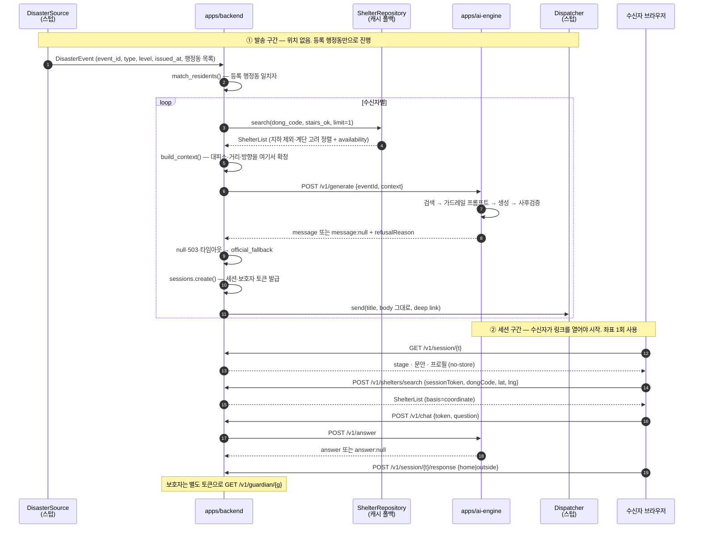

# 워킹 스켈레톤 상세 — 재난 1건이 관통하는 코드 경로

현재 저장소에 있는 **워킹 스켈레톤이 실제로 어떻게 동작하는지**를 모듈·함수 단위로 설명하는 문서입니다. 자기 파트를 붙일 때 "어디를 건드려야 하고, 무엇을 건드리면 안 되는지"를 코드를 다 읽지 않고도 알 수 있게 하는 것이 목적입니다.

- **왜 그렇게 결정했는가**는 여기 없습니다 → [ADR-0007](../adr/0007-walking-skeleton.md)(관통 구조 결정), [ADR-0006](../adr/0006-generation-contract.md)(생성 계약), [ADR-0005](../adr/0005-webpush-primary-channel.md)(웹푸시·문안 그대로 전달).
- **인터페이스 원본**은 [`packages/contracts/openapi.yaml`](../../packages/contracts/openapi.yaml) 한 파일입니다. 이 문서와 코드가 스펙과 어긋나면 **스펙이 맞습니다.**
- 기획 단계 설계도는 [아키텍처.md](아키텍처.md)에 있습니다. 그쪽이 "무엇을 만들 것인가", 이 문서가 "지금 무엇이 돌아가는가"입니다.

> ⚠️ **여기 있는 것은 서비스가 아니라 뼈대입니다.** 외부 의존(공공 API·HyperCLOVA X·FCM·Chroma·실제 국민행동요령 코퍼스·실사용자 저장소)은 **전부 오프라인 스텁**이며, 번들 코퍼스는 `[더미]` 표시된 미검증 텍스트입니다. 이 상태로 근거 일치율을 재면 더미와의 일치율을 재게 됩니다(§10).

---

## 1. 한눈에 보기

관통 경로는 두 구간으로 나뉩니다. **발송 구간**은 재난 1건이 들어와 푸시가 나갈 때까지 서버가 혼자 도는 구간이고, **세션 구간**은 수신자가 링크를 연 뒤에야 시작됩니다. 위치(좌표)는 두 번째 구간에서만 등장합니다.



### 모듈 지도

| 파일 | 역할 |
|---|---|
| [`backend_core/ingest.py`](../../apps/backend/src/backend_core/ingest.py) | 수신 이음매 (`DisasterSource`), 데모 이벤트 생성 |
| [`backend_core/matching.py`](../../apps/backend/src/backend_core/matching.py) | 대상자 매칭, 특보 등급 → 화면 단계, 위험구역 판정 |
| [`backend_core/shelters.py`](../../apps/backend/src/backend_core/shelters.py) | 대피소 조회·안전 필터·거리/방향 계산·캐시 폴백 |
| [`backend_core/pipeline.py`](../../apps/backend/src/backend_core/pipeline.py) | **관통 본체** — 위 조각을 순서대로 엮고 지연시간을 잰다 |
| [`backend_core/ai_client.py`](../../apps/backend/src/backend_core/ai_client.py) | ai-engine과의 **유일한** 결합점 (HTTP) |
| [`backend_core/fallback.py`](../../apps/backend/src/backend_core/fallback.py) | `official_fallback` 문구가 존재하는 **유일한** 장소 |
| [`backend_core/sessions.py`](../../apps/backend/src/backend_core/sessions.py) | 세션·보호자 토큰, TTL, 열람/응답 기록 |
| [`backend_core/registry.py`](../../apps/backend/src/backend_core/registry.py) | 등록자·기기 토큰, 데모 시드 |
| [`backend_core/models.py`](../../apps/backend/src/backend_core/models.py) | 계약 모델 + **프라이버시 경계**(`Profile` → `RecipientContext`) |
| [`api/routes/*.py`](../../apps/backend/src/api/routes/) | 얇은 라우터 — 검증 → 도메인 호출 → 응답 매핑 |
| [`ai_engine/retrieval.py`](../../apps/ai-engine/src/ai_engine/retrieval.py) | 조건부 검색(재난유형 하드필터 + 프로필 태그 부스트) |
| [`ai_engine/guardrail.py`](../../apps/ai-engine/src/ai_engine/guardrail.py) | 가드레일 프롬프트 + 출력 사후검증 |
| [`ai_engine/generation.py`](../../apps/ai-engine/src/ai_engine/generation.py) | 생성 오케스트레이션, 거절 판단 |
| [`ai_engine/service.py`](../../apps/ai-engine/src/ai_engine/service.py) | `/v1/generate`, `/v1/answer` |

---

## 2. 발송 구간 — `run_alert()` 한 함수의 6단계

진입점은 [`backend_core.pipeline.run_alert()`](../../apps/backend/src/backend_core/pipeline.py)이고, HTTP로는 `POST /internal/alerts/dispatch`가 이 함수를 호출합니다.

### 2-1. 수신

`DisasterSource` 프로토콜(`poll() -> list[DisasterEvent]`)이 이음매입니다. 지금 있는 구현은 `StaticDisasterSource`(고정 목록)와 `demo_flood_warning()`(데모 호우경보) 둘뿐이고, 실제 폴링 스케줄러는 Backend/Infra S1-1 작업입니다.

`DisasterEvent`는 수신·매칭·생성 전 구간을 **하나의 형태로** 지나갑니다. 이 중 `issued_at`이 지연시간 KPI의 기산점이고, **수신 시각으로 덮어쓰지 않습니다.** 덮으면 지표가 우리 내부 처리시간만 재게 됩니다. 과거 특보 리플레이가 원본 `issued_at`을 그대로 들고 오는 것도 같은 이유입니다.

### 2-2. 매칭 — 위치가 아니라 등록 행정동

```python
residents = match_residents(event, registry)   # registry.by_dong_codes(event.affected_dong_codes)
stage = stage_for(event.level)                 # preliminary→1, advisory→2, warning→2
```

발송 시점에 시스템은 **누구의 실시간 위치도 갖고 있지 않습니다.** "상시 추적 없음"이 약속이 아니라 구조인 이유가 이것입니다 — 선택에 쓸 위치가 애초에 없습니다.

`stage_for()`의 매핑표는 **2값입니다.** 3단계(위험 실현)를 만들 원천이 특보 등급에는 없어서, 추측 매핑을 넣으면 가장 긴급한 화면이 근거 없이 뜹니다. 프론트는 그동안 `STAGE3_ENABLED=false`로 가립니다.

### 2-3. 대피소 확정 — **생성보다 먼저**

```python
shelter_list = shelters.search(dong_code=..., disaster_type=..., hazard="inside",
                               stairs_ok=profile.stairs_ok, limit=1)
```

[`ShelterRepository`](../../apps/backend/src/backend_core/shelters.py)가 하는 일은 세 가지입니다.

1. **소스 선택** — 실시간 소스(`UnavailableShelterSource`, 지금은 항상 예외) 실패 시 번들 캐시(`CachedShelterSource`)로 폴백. 실패를 빈 목록이 아니라 **예외**로 올리는 것이 핵심입니다. 빈 목록은 "주변에 대피소가 없다"로 읽혀서 사용자를 그 자리에 머물게 합니다.
2. **안전 필터** — 호우/침수에서 **지하 시설은 서버가 제거**하고, 제외 사유·건수를 `excluded`로 응답에 남깁니다. 조용히 거르면 데이터 누락처럼 보입니다.
3. **정렬** — `(계단 있음 and 계단 이용 불가, 거리, id)`. 계단을 못 쓰는 사람에게 "가장 가까운 대피소"는 "가장 가까운 **이용 가능한** 대피소"가 아닙니다. 계단 있는 곳도 목록에는 남되 맨 위에는 오지 않습니다.

거리는 `haversine_m()` 직선거리이며, 도보 경로가 아닙니다(라우팅 API가 들어오면 별도 필드). 좌표가 없을 때(발송 구간)는 그 행정동 대피소들의 평균 좌표를 원점으로 쓰고 `basis="dongCode"`로 표기합니다 — 실제 행정동 좌표표는 Backend S1-1에서 교체됩니다.

### 2-4. 생성 — 안전 값은 이미 확정된 채로 넘어간다

```python
context = build_context(event, profile, shelter_list)   # GenerationContext
message = _generate(ai, event, context)                 # 실패·거절 시 official_fallback
```

`GenerationContext`가 **엔진이 사실로 취급해도 되는 값의 전부**입니다.

| 필드 | 값 | 비고 |
|---|---|---|
| `issuedAt` | 특보 발표 시각 | KPI 기산점 |
| `disaster` | `{type: "flood", severity}` | `preliminary`는 `advisory`로 **낮춰서** 전달 (등급을 올리면 안내가 특보를 앞지름) |
| `recipient` | `RecipientContext` | 신원 없음 (§4) |
| `shelter` | 백엔드가 고른 1곳 또는 `null` | `null`은 "보낼 곳이 없다"는 **정보**이지 결측이 아님 |
| `hazardZones` | ⚠️ 지금은 항상 `[]` | 위험구역 데이터·Shapely 투입 시 채워짐 (Backend S1-2) |
| `dataAsOf`·`serviceMode` | 대피소 데이터 시점·서비스 등급 | `cache_only`면 문안이 "실시간 아님"을 밝힘 |

**대피소·거리·방향을 backend가 정하는 것은 편의가 아니라 안전 결정입니다.** GIS 판단이 LLM으로 새면 환각이 곧 잘못된 대피 지시가 됩니다(ADR-0006). ai-engine은 이 값을 **그대로 반복**할 뿐 재계산하지 않습니다.

### 2-5. 세션 발급

`SessionStore.create()`가 세션 토큰(`s_…`)과 보호자 토큰(`g_…`)을 한 번에 발급합니다. 둘 다 `secrets.token_urlsafe(32)` 기반이고, 같은 세션을 가리키되 **응답 내용이 다릅니다**(보호자에게는 좌표도, 문안 원문도 가지 않습니다).

- **소비형 토큰이 아닙니다.** 링크 미리보기·새로고침·보호자 재진입이 모두 읽기이므로, 첫 읽기에 토큰을 태우면 사용자가 [집이에요]를 누르기 전에 410이 납니다. 유출 대응은 TTL(기본 6시간)의 몫입니다.
- `SessionRecord`에는 **좌표 필드가 존재하지 않습니다.** 이 사실은 `test_no_location_is_persisted`가 고정합니다.
- 세션은 **기기 유무와 무관하게** 발급됩니다. 기기가 없어 푸시가 못 나간 사람도 링크 자체는 유효하며, 그 사실은 `skippedNoDevice`에 남습니다.

### 2-6. 발송

`Dispatcher.send(PushPayload)` — P1 기본 구현은 `RecordingDispatcher`(메모리에 기록)이며, FCM 자격증명은 배포 VM에만 존재하고 CI는 실제 푸시 엔드포인트를 절대 치지 않습니다.

- **본문은 생성 문안 그대로입니다.** 템플릿도, 승인된 슬롯 집합도, 렌더링 어댑터도 없고 다시 넣어서도 안 됩니다(ADR-0005). 평가 하네스가 채점하는 문자열과 사용자가 받는 문자열이 **같아야** 근거 일치율·명확성 지표가 의미를 가집니다.
- 딥링크는 `{base}/a?t={token}&s={stage}` 이고, `?s=`는 **힌트일 뿐** 권위는 세션 응답의 `stage`에 있습니다. 오래된 알림이나 조작된 URL이 화면 상태를 바꾸면 안 됩니다.
- 알림 액션 버튼에 의존하지 않습니다(플랫폼 편차). [집이에요]/[밖이에요]는 랜딩 페이지에 있습니다.

---

## 3. 세션 구간 — 링크를 연 뒤

| 엔드포인트 | 하는 일 | 이 구간의 규칙 |
|---|---|---|
| `GET /v1/session/{token}` | 단계·문안·프로필 반환, `openedAt` 최초 1회 기록 | 이름·주거형태·보호자 전화가 한 응답에 들어오므로 `Cache-Control: no-store` |
| `POST /v1/shelters/search` | 대피소 목록 | **POST인 이유가 프라이버시** — 좌표가 쿼리스트링에 있으면 브라우저 히스토리·프록시·액세스 로그에 남습니다. `stairsOk`는 클라이언트가 되보내지 않고 서버가 세션으로 조회합니다 |
| `POST /v1/chat` | 후속 Q&A | 근거 없으면 `answer: null` + 200 (§5) |
| `POST /v1/session/{token}/response` | [집이에요]/[밖이에요] 기록 | 좌표를 받지 않습니다. **생존 신호가 아니라 상호작용 기록**입니다 |
| `GET /v1/guardian/{token}` | 보호자 현황 | `openedAt` / `respondedAt` / `safetyStatus` 3축 분리, 좌표 없음 |
| `POST /v1/guardian/{token}/acknowledge` | 보호자 [확인했음] | 피보호자 안전과 무관 |
| `GET /v1/registration/{token}` | 대리등록 대상 확인 | 이름·행정동·등록주체만. 장애/건강 필드 없음 |
| `POST`·`DELETE /v1/devices` | 기기 토큰 부착/해제 | **등록 토큰** 기준(세션 토큰 아님). 세션은 발송 때 생기므로, 세션을 요구하면 "푸시를 받아야 푸시를 받을 수 있다"는 순환이 됩니다. 해제는 멱등 |

위험구역 판정(`hazard_match()`)은 이 구간에서, **검색한 위치 기준**으로 합니다. 판단 불가는 `unknown`이며 **`outside`로 낮추지 않습니다** — 확인하지 못했다는 이유로 "위험 지역 밖"이라고 말하면, 그 한마디가 사람을 그 자리에 머물게 합니다.

좌표는 `ShelterSearchRequest` → `repository.search()` 인자로만 흐르고 스코프를 벗어나면 사라집니다. 저장도 로깅도 하지 않습니다.

---

## 4. 앱 경계 — 무엇이 ai-engine으로 건너가는가

```
apps/backend  ──HTTP only──>  apps/ai-engine
              (backend_core/ai_client.py 가 유일한 통로)
```

파이썬 import는 **양방향 모두 금지**입니다. 계약 모델도 공유하지 않고 각자 스펙에서 다시 만듭니다 — 코드를 공유하는 순간 "독립 배포 가능한 AI 모듈"이라는 성질이 조용히 사라집니다.

경계를 넘는 수신자 정보는 `Profile.to_recipient_context()` **명시 투영 하나뿐**입니다.

| `Profile`(내부) | `RecipientContext`(경계 통과) |
|---|---|
| `userId`, `name`, `dongCode`, `bjdCode`, `guardian`, `registeredBy` | ❌ |
| `vision`, `hearing` | ❌ — **화면**을 바꾸지 **문장**을 바꾸지 않음 |
| `dongName`, `housing`, `mobility`, `stairsOk`, `easyText`, `language`, `livesAlone`, `care` | ✅ |

`model_dump()` 필터링이 아니라 필드를 하나씩 적는 투영인 이유: `Profile`에 새 민감 필드가 추가돼도 **자동으로 따라 넘어가지 않게** 하기 위해서입니다. `test_profile_projection_drops_identity`·`test_only_recipient_context_crosses_the_app_boundary`가 이를 고정하고, ai-engine 쪽은 `extra="forbid"`라 화면 전용 필드를 보내면 **422로 거부**합니다.

---

## 5. ai-engine 내부 — 검색 → 프롬프트 → 생성 → 사후검증

파이프라인 방향은 단방향이며, `retrieval`은 `generation`을 import하지 않습니다. **검색은 엔드포인트로 노출되지 않습니다**(단방향 파이프라인 중간에 외부 호출자를 들이지 않기 위해). 평가 하네스는 `ai_engine.retrieval`을 직접 import해서 접근하고, 그래서 이 모듈은 FastAPI에 의존하지 않습니다.

### 5-1. 검색 (`FixtureRetriever`)

- **재난유형은 하드 필터**입니다. 호우 지침을 다른 재난에 인용하면 "근거는 있는데 상황이 틀린" 최악의 오답이 됩니다.
- **프로필 태그는 부스트**(`TAG_BOOST = 0.15`)이지 필터가 아닙니다. 하드 필터로 걸면 태깅이 부족한 코퍼스에서 회수가 0이 되고, 재난 중 "근거 없음"은 전원 폴백을 뜻합니다.
- 점수 = 질의와의 문자 bigram 중첩 + 태그 부스트. 최소 어휘 중첩(`MIN_LEXICAL_OVERLAP = 0.05`) 미만은 탈락시킵니다 — 이게 없으면 "주식 전망 알려줘" 같은 질문도 태그 부스트만으로 근거를 얻습니다.
- 정렬 tie-break가 `id`라 **같은 입력이면 항상 같은 순서**입니다(KPI 재현성).
- 발송 구간에는 사용자 질문이 없으므로 `build_query()`가 프로필로 질의를 합성합니다.

> ⚠️ 어휘 기반이라 **의역에 약합니다.** "애를 데려가도 돼요?"는 영유아·가족이라 쓰인 코퍼스에서 아무것도 회수하지 못하고, 챗봇은 침묵합니다. 침묵은 안전한 실패지만 재현율 실패는 맞습니다 — Chroma + 한국어 임베딩 교체(AI/RAG S1-1~S1-2)가 이걸 없앱니다.

### 5-2. 가드레일 2단

**1단 프롬프트**(`GUARDRAIL_PROMPT_V0`) — 7개 절대 규칙: 근거·확정사실만 사용 / 수치·주소·기관명·대피소명 창작 금지 / 확정 사실은 **그대로** / 즉시 실행 가능한 행동 지시 **하나** / 3문장 이하 쉬운 말 / 안전 단정 표현 금지 / 근거 없으면 `NO_EVIDENCE`만 출력.

슬롯은 4개로 분리돼 있습니다 — `context`(상황, 발송 경로), `question`(사용자 문장, 챗봇 경로), `facts`(백엔드 확정 사실 — 인용문이 아니지만 그대로 반복해야 하는 값), `evidence`(국민행동요령 원문). 사용자 질문이 "확정된 상황"으로 섞이지 않게 하는 것이 분리의 목적입니다.

**2단 출력 사후검증**(`verify()`) — 프롬프트는 요청이지 보장이 아니므로, 생성된 문장을 회수 근거와 대조합니다.

| 위반 | 판정 조건 |
|---|---|
| `empty_output` | 빈 문자열 또는 `NO_EVIDENCE` |
| `no_evidence` | 근거 0건 |
| `missing_action` | 명령형 어미(`하세요`·`주세요`·`마세요`…) 없음 — 챗봇은 면제(`require_directive=False`) |
| `unsupported_claim` | 문장의 bigram 중 근거·허용 문구와 겹치는 비율 < `SUPPORT_THRESHOLD = 0.5` |

허용 문구(`allowed_phrases`)는 **검토된 문안 프레임 + 이번 요청의 확정 사실**(행정동명, 대피소명, 거리)입니다. 프레임을 넓히는 것은 조용히 느슨해지는 게 아니라 **눈에 보이는 diff**여야 하므로 명시적으로 선언합니다.

> ⚠️ `enabled=False`일 때 `passed`는 `True`가 아니라 **`False`** 입니다. 검증하지 않은 것이 통과로 집계되면 환각 억제율의 대조군 수치가 오염됩니다. on/off 스위치는 **같은 평가셋을 두 모드로 돌리기 위해서만** 존재합니다 — 테스트나 데모를 통과시키려고 끄는 것은 고치는 게 아니라 KPI를 무효화하는 것입니다.

v0 검증이 어휘 기반인 이유: 모델 채점은 메시지당 외부 호출을 추가해 30초 예산과 CI 결정성을 동시에 해칩니다. 교차 모델 채점(채점 모델 ≠ 생성 모델)은 [`apps/ai-engine/eval/`](../../apps/ai-engine/eval/) 하네스의 몫입니다.

### 5-3. 생성 (`generate_message()`)

순서가 고정돼 있습니다: **안전 불가 선판정 → 검색 → 프롬프트 → 생성 → 지시문 부착 → 사후검증 → (이탈 시) 거절.**

- **선판정**: 대피소가 없고(`shelter is null`) 계단도 못 쓰면(`stairsOk: false`) → `refusalReason: "unsafe"`. 남는 선택지가 수직 대피뿐인데 그게 불가능한 사람이므로, **어떤 지시를 써도 안전하지 않습니다.** 백엔드의 폴백(119·보호자 연결)으로 넘깁니다.
- **지시문은 모델이 이름 짓지 않습니다.** 대피소명이 들어간 문장은 확정 사실로 코드가 덧붙이며, 허용 문구 집합에 이미 들어 있습니다.
- `serviceMode: cache_only`면 데이터 시점 고지 문장이 자동으로 붙습니다. 낡은 데이터를 실시간인 척 내리지 않습니다.
- `StubGenerator`는 프롬프트의 `<근거>` 블록에서 첫 인용을 뽑아 상황 문장과 합칩니다. **의역하지 못하는 것이 정상**입니다 — 스켈레톤이 검증하는 것은 문장력이 아니라 접지(grounding)입니다.

---

## 6. 실패는 오류가 아니라 등급 하락

이 스켈레톤에서 **어떤 단계도 실행 전체를 중단시키지 않습니다.** 한 수신자의 실패는 그 수신자만 강등시키고, 루프를 빠져나가는 예외는 뒤에 줄 선 사람 전부를 조용히 떨어뜨립니다.

| 상황 | ai-engine 응답 | backend 처리 | 사용자가 받는 것 |
|---|---|---|---|
| 근거 없음 | 200 `message: null` + `no_evidence` | `official_fallback` 치환 | 사전 승인 고정 문구 |
| 안전한 지시 불가 | 200 `message: null` + `unsafe` | 〃 | 〃 |
| 가드레일 이탈 | 200 `message: null` + `unsafe` | 〃 | 〃 |
| 모델·벡터DB 장애 | **503** | `AiEngineUnavailableError` → 폴백 | 〃 |
| 타임아웃(8초)·연결 실패 | — | 〃 | 〃 |
| **챗봇**에서 위 전부 | 200 `answer: null` | 그대로 전달 (200) | "확인된 지침이 없습니다" |
| 대피소 실시간 소스 장애 | — | 캐시 폴백 | `availability: cache_only` + `dataAsOf` 표기 |
| 캐시도 비어 있음 | — | — | `availability: upstream_unavailable` |
| 후보는 있었으나 전부 위험 | — | — | `availability: all_excluded` + `excluded` 사유 |
| 기기 토큰 없음 | — | 세션은 발급, 발송만 생략 | (도달 불가 — `skippedNoDevice`에 집계) |

**발송과 챗봇이 다른 이유**는 비대칭입니다. 발송 문안은 반드시 도달해야 하지만, 질의 응답은 근거가 없으면 침묵하는 편이 안전합니다. 재난 중에는 "완벽하지 않은 문안"보다 "아무것도 안 오는 것"이 나쁘고, 반대로 "모른다는 답"보다 "지어낸 답"이 나쁩니다.

`official_fallback`을 만드는 곳은 [`backend_core/fallback.py`](../../apps/backend/src/backend_core/fallback.py) 하나뿐입니다. **폴백이 필요한 상황의 대부분이 ai-engine에 물어볼 수 없는 상황**이라, 결정권을 엔진에 두면 정작 필요한 순간 아무도 내리지 못합니다. 폴백 문구는 `sources: []`입니다 — 근거에서 나오지 않은 문장에 인용을 붙이면 그게 바로 근거 일치율이 잡아내려는 실패입니다.

> ⚠️ 현재 폴백 문구는 **QA/보안 검토 전**입니다. 자리표시자로 취급하세요.

에러 응답은 계약 형태 `{code, message}`이며, 프론트가 실제로 다르게 행동하는 **404(잘못된 링크) / 410(지난 알림)** 구분이 와이어까지 살아 있어야 합니다([`api/errors.py`](../../apps/backend/src/api/errors.py)).

---

## 7. 측정 지점

| 지표 | 어디서 나오는가 |
|---|---|
| 알림 도달 속도 | `AlertRun.mean_latency_ms` / `p95_latency_ms` → `POST /internal/alerts/dispatch` 응답 |
| 환각 억제율 | `GuardrailReport.violations` + 응답의 `guardrailApplied` (on/off 대조) |
| 근거 일치율 | 응답 `sources[].quote`(회수 원문 그대로) vs 생성 문안 — ⚠️ 더미 코퍼스로는 측정 금지 |
| 도달 불가 | `skippedNoDevice` |

구간 측정은 `perf_counter()`(단조 시계), 타임스탬프는 벽시계입니다. 벽시계 두 점을 빼면 NTP 보정이 측정 구간 안으로 들어올 수 있고, 시각을 주입한 리플레이에서는 아예 아무것도 측정하지 못합니다. p95는 보간 없는 **nearest-rank**입니다(제출 지표는 재현 가능해야 합니다).

`run_alert(now=...)`가 주입 가능한 이유도 리플레이입니다 — 과거 호우 특보를 같은 경로로 흘려도 매번 같은 숫자가 나와야 합니다.

⚠️ `Delivery.latency_ms`는 **run 시작 시점 기준 누적 경과**입니다. 수신자별 처리시간이 아니라 "그 사람에게 발송이 끝난 시각"이므로, 뒤 순번일수록 큽니다. 이것이 사용자가 실제로 기다린 시간에 대응합니다.

---

## 8. 직접 돌려 보기

```bash
# 터미널 2개
uvicorn ai_engine.service:app --reload --port 8100     # ai-engine
uvicorn api.main:app --reload --port 8000              # backend

# 관통 1회 — 데모 호우경보를 시드 행정동(서원동)에 발사
curl -X POST localhost:8000/internal/alerts/dispatch | jq
```

기대 결과: `matched: 2`, `dispatched: 2`, 각 delivery의 `messageMode: "grounded"`, `sessionToken`/`guardianToken` 발급.

```bash
T=<응답의 sessionToken>
curl -s localhost:8000/v1/session/$T | jq '.stage, .message.body'
curl -s -X POST localhost:8000/v1/shelters/search \
  -H 'content-type: application/json' \
  -d "{\"sessionToken\":\"$T\",\"dongCode\":\"1162064500\",\"lat\":37.4845,\"lng\":126.9285}" | jq
curl -s -X POST localhost:8000/v1/chat -H 'content-type: application/json' \
  -d "{\"token\":\"$T\",\"question\":\"지하 주차장에 있어도 되나요?\"}" | jq
```

**ai-engine을 끄고 같은 명령을 다시 돌려 보세요.** 여전히 200이 나오고 `messageMode`만 `official_fallback`으로 바뀝니다 — 그 강등이 설계된 동작이며, 버그가 아닙니다.

시드 데이터: 등록자 2명(반지하·계단 불가 고령자 / 외국인 근로자, 같은 행정동), 대피소 6곳(지하 2곳은 서버가 제외 → 4곳), 코퍼스 10개 `[더미]` 문단.

```bash
bash scripts/run-tests.sh          # ruff + mypy + pytest (= CI). backend 62 + ai-engine 43
```

---

## 9. 이음매 카탈로그 — 여기를 바꾸면 됩니다

교체 조건은 **호출부가 바뀌지 않는 것**입니다. 스텁을 감싸지 말고 이음매에서 갈아 끼우세요.

| 이음매 | 지금 구현 | 교체 대상 | 소관 / 일정 |
|---|---|---|---|
| `DisasterSource.poll()` | `StaticDisasterSource` | 기상청·소방청 Open API 폴링 스케줄러(중복 제거·백오프) | Backend S1-1 |
| `hazard_match()` | 행정동 코드 포함 여부 | Shapely point-in-polygon + 위험구역 데이터 | Backend S1-2 |
| `ShelterSource.fetch()` | `UnavailableShelterSource`(항상 예외) → 캐시 | 재난안전데이터 API | Backend S1-2 |
| `_origin()` | 대피소 평균 좌표 | 행정동 코드 좌표 매칭 테이블 | Backend S1-1 |
| `ResidentRegistry` / `SessionStore` | 프로세스 로컬 dict | 실저장소(민감 필드 **암호화 필수**) / Redis·DB | Backend S1-2 |
| `Dispatcher.send()` | `RecordingDispatcher` | FCM Admin SDK | Frontend·Backend |
| `Retriever.search()` | `FixtureRetriever`(어휘) | Chroma + 한국어 임베딩 | AI/RAG S1-1~S1-2 |
| 코퍼스 fixture | `[더미]` 10문단 | 실제 국민행동요령 전처리·청킹 결과 | AI/RAG S1-1 |
| `Generator.complete()` | `StubGenerator` | HyperCLOVA X 클라이언트(LangChain) | Tech Lead |
| `verify()` | 어휘 기반 v0 | 교차 모델 채점(하네스 측) | AI/RAG·QA |

교체할 때 함께 봐야 하는 것:

- **HyperCLOVA X 투입 시** — `SAVERS_AI_ENGINE_TIMEOUT_S = 8.0`은 **추정값**입니다. 30초 예산 안에서 실측으로 재산정하세요. 재시도는 넣지 않았습니다(이미 실패 중인 서비스에 남은 예산을 쓰느니 폴백이 빠르고 항상 가능).
- **Chroma 투입 시** — `score` 체계가 바뀌므로 계약의 `score` 설명과 `SUPPORT_THRESHOLD` 재튜닝 값을 **하네스에 기록**하세요(누군가의 머릿속 말고).
- **재난 유형 확장 시** — `DisasterType`·검색 조건·코퍼스 태그를 **같은 PR에서** 함께 넓히세요.
- **무거운 의존**(LangChain·Chroma·geo)은 앱의 optional extra로. 코어 `dependencies`에 넣으면 모든 CI가 RAG 스택을 끌고 옵니다.

---

## 10. 테스트가 고정하는 불변식

바꾸려다 이 테스트들이 깨진다면, **깨지는 것이 맞는 상황**인지 먼저 확인하세요.

| 테스트 | 고정하는 것 |
|---|---|
| `test_no_location_is_persisted` | 세션에 좌표 필드가 생기지 않음 |
| `test_only_recipient_context_crosses_the_app_boundary` | 신원이 앱 경계를 넘지 않음 |
| `test_profile_projection_drops_identity` / `test_screen_only_recipient_fields_are_rejected` | 투영 누락·화면 전용 필드 유입 차단 |
| `test_push_body_is_delivered_verbatim` | 슬롯 치환 계층 부활 방지 |
| `test_engine_refusal_becomes_the_approved_fallback` / `test_ai_outage_lands_in_the_same_place_as_a_refusal` | 거절과 장애가 같은 자리로 수렴 |
| `test_disabled_guardrail_is_not_a_pass` / `test_guardrail_on_off_delta_is_observable` | 대조군 수치 오염 방지 |
| `test_hallucination_is_caught_and_refused` | 사후검증이 실제로 잡아냄 |
| `test_underground_shelters_are_excluded_server_side` | 지하 대피소 서버 제외 |
| `test_stair_free_shelter_is_chosen_for_those_who_need_it` | 계단 불가자 정렬 |
| `test_unknown_is_not_downgraded_to_outside` | 판단 불가를 "안전"으로 바꾸지 않음 |
| `test_no_shelter_and_no_stairs_is_unsafe` | 안전한 지시가 없으면 거절 |
| `test_stage_mapping_never_produces_stage_three` | 3단계 추측 매핑 금지 |
| `test_severity_mapping_never_overstates_the_alert` | 등급 상향 금지 |
| `test_retrieval_is_not_exposed` | 검색 엔드포인트 미노출 |
| `test_upstream_down_and_nothing_cached_says_so` / `test_all_excluded_is_distinct_from_no_data` | `items: []`의 4분 의미 유지 |

앱을 가로지르는 종단 검증은 [`e2e/`](../../e2e/)(QA 소관, HTTP only, non-required 워크플로)에 있습니다. `apps/*/tests/`에 두면 required 매트릭스가 이를 수집해 모든 PR이 스택 기동에 묶입니다.

---

## 11. 지금 믿으면 안 되는 것

| 항목 | 실제 상태 |
|---|---|
| 근거 일치율 측정 | ❌ 불가 — 코퍼스가 `[더미]`. 지금 재면 더미와의 일치를 재는 것 |
| 위험구역 회피 문구 | ❌ `hazardZones`가 항상 `[]`이라 문안에 등장하지 않음 |
| 실시간 대피소 | ❌ 항상 캐시(`cache_only`), `dataAsOf`는 2026-07-27 고정 |
| 도보 거리 | ❌ 직선거리(haversine). 라우팅 API 미투입 |
| 세션 지속성 | ❌ 인메모리 — 재시작하면 진행 중 알림 링크 무효 |
| 지연시간 수치 | ⚠️ 스텁 기준. LLM·FCM 실호출이 들어오면 재측정 필요 |
| `/internal/*` 노출 | ⚠️ 인증 없음 — Caddy가 `/internal/*`을 404로 끊어 외부에서는 닿지 않습니다. VM 안에서는 무인증 그대로입니다 ([ADR-0007](../adr/0007-walking-skeleton.md) 각주) |
| 폴백 문구 | ⚠️ QA/보안 검토 전 |
| 3단계 화면 | ⚠️ 원천 미정의 — 서버가 만들지 않음 |
| 챗봇 재현율 | ⚠️ 어휘 검색이라 의역 질의에 침묵 |

---

## 12. 관련 문서

- [워킹_스켈레톤_점검.md](워킹_스켈레톤_점검.md) — 각 단계를 **직접 돌려 확인**하는 명령과 통과 기준
- [ADR-0007 워킹 스켈레톤 관통 구조](../adr/0007-walking-skeleton.md) — **왜** 이렇게 관통시켰는가 (9개 결정)
- [ADR-0006 생성 계약](../adr/0006-generation-contract.md) — backend ↔ ai-engine 계약의 근거
- [ADR-0005 웹푸시 1차 채널](../adr/0005-webpush-primary-channel.md) — 문안 그대로 전달, 렌더링 어댑터 폐기
- [packages/contracts/openapi.yaml](../../packages/contracts/openapi.yaml) — 인터페이스 원본
- [아키텍처.md](아키텍처.md) — 목표 아키텍처(기획 기준)
- [개발자_가이드.md](개발자_가이드.md) — 저장소 구조·설계 원칙·품질 지표
- [역할_일정/00-overall.md](../역할_일정/00-overall.md) — 이음매 교체 일정(P1~P5)
