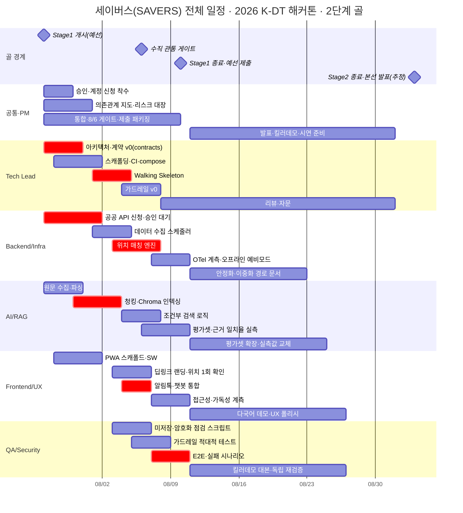
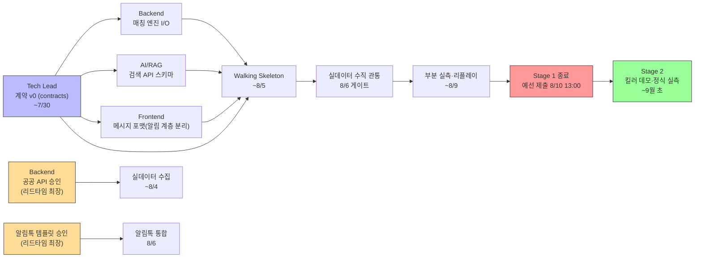

# 전체 통합 타임라인 — 2단계 골(예선 통과 → 본선 발표)

전 역할의 작업을 하나의 시간축에 얹은 문서입니다. 개별 역할의 상세는 [01~06 개별 타임라인](README.md#문서-목록)을 참고하세요. 프레임(2단계 골·서브페이즈·기준 날짜)은 [README.md](README.md)에서 확정합니다.

이 프로젝트는 순차적인 **두 개의 골**을 통과 대상으로 삼습니다. 각 골은 아래 **Exit Criteria**(통과 조건)로 판정하며, Stage 1을 통과해야 Stage 2가 시작됩니다.

- **Stage 1 · 예선 통과** (7/27~8/10) — 실데이터 수직 관통 + **부분 실측 지표**. 완성도 기준선은 "중간(관통 + 부분 실측)".
- **Stage 2 · 본선 발표** (8/11~9월 초) — **킬러 데모** 완결 + 4대 지표 정식 실측값 교체 + 발표.

---

## Stage 1 Exit Criteria — 예선 통과 판정

8/10 13:00 제출 시점에 **전항 충족**해야 예선 통과로 간주합니다. (판정 주체: PM, 검증: QA)

| # | 통과 조건 | 완성도 | 주 담당 |
|---|---|---|---|
| **S1-E1** | 실데이터로 `감지→매칭→RAG→생성→발송` 수직 관통 동작 | 달성 | Tech Lead·Backend·AI/RAG·Frontend |
| **S1-E2** | **근거 일치율**·**알림 도달 속도(p95)** — 실측값 확보 | 실측 | AI/RAG·Backend |
| **S1-E3** | **환각 억제율**·**메시지 명확성** — 1차 측정치(잠정) 확보 | 1차 측정 | QA·Frontend |
| **S1-E4** | 채점 스크립트 + 평가셋(30~50건)을 코드와 함께 제출, 재현 가능 | 달성 | AI/RAG·QA |
| **S1-E5** | `apps/ai-engine` 독립 배포 증빙(자체 Dockerfile·README) | 달성 | Tech Lead |
| **S1-E6** | 미저장·암호화 점검 통과 + 가드레일 근거강제·미확보 시 생성거부 동작 | 달성 | QA·Backend·Tech Lead |
| **S1-E7** | 실측 반영판 기획서/README + Before/After **실제 수신 화면 캡처** 포함 제출 | 달성 | PM·Frontend |

> **부분 실측 원칙**: S1-E2(근거 일치율·도달 속도)는 반드시 실측, S1-E3(환각 억제율·명확성)은 1차 측정치 허용. 네 지표의 정식 실측값·신뢰구간은 Stage 2에서 교체합니다. v4 「정량 목표」의 수치(30초·85%·50%·90/100%)는 가설 목표치이며 실측값으로 대체됩니다.

## Stage 2 Exit Criteria — 본선 발표 판정

| # | 통과 조건 | 주 담당 |
|---|---|---|
| **S2-E1** | **킬러 데모**: 호우·도시침수 1종 × 페르소나 2(**반지하 고령자 + 외국인 근로자**) × 특정 행정동 1곳의 끊김 없는 단일 흐름 | 전원 |
| **S2-E2** | 4대 지표 **정식 실측값** 교체 + 평가셋 확장(신뢰구간 확보) | AI/RAG·QA |
| **S2-E3** | **실패 모드 안전장치 시연 대본** — 성공만이 아니라 API장애·위치실패·가드레일 이탈 시 동작 시연([리스크.md](../공통_가이드/리스크.md) ②) | QA·PM |
| **S2-E4** | 발표 스토리라인: 문제 정의 → 차별화 3축(정보vs행동·정적vs생성·일방향vs에이전틱) → B2B/B2G 지속가능성 → 3단계 확산 로드맵 | PM |
| **S2-E5** | 안전디딤돌 2026.6.15 개편 반영 실명 비교표 + 확산 로드맵(능동형/개방형 QR/CBS 연동) 발표자료 | PM |

---

## 1. 전체 Gantt

`crit`(빨간색) 표시는 밀리면 뒤 단계 전체가 밀리는 **임계경로** 작업입니다. `S1-*`/`S2-*` 마일스톤이 각 골의 경계입니다.

## 2. 골·서브페이즈별 전 역할 매트릭스

| 골 · 서브페이즈 (기간) | PM | Tech Lead | AI/RAG | Frontend | Backend | QA |
|---|---|---|---|---|---|---|
| **S1-1 골격** 7/27~8/2 | 승인·계정 신청·킥오프 → 의존관계 지도·리스크 대장 | **아키텍처·계약 v0(알림 계층 분리 포함), 스캐폴딩·CI·compose** | 원문 허가·수집 → 파싱·청킹·Chroma 인덱싱 | PWA 스캐폴드·SW | 공공 API·계정 신청 → 수집 스케줄러·행정동 코드표·위험구역 파이프라인 | 개보법 체크리스트 → 테스트 프레임워크 셋업 |
| **S1-2 수직 관통** 8/3~8/6 | 통합 조율, **8/6 게이트 점검** | **Walking Skeleton·가드레일 v0** | 조건부 검색 로직 | **딥링크 랜딩·알림톡·챗봇 통합** | **위치 매칭 엔진·미저장 처리·발송 트리거** | 미저장·암호화 점검, 가드레일 적대적 테스트 |
| **S1-3 실측·제출** 8/7~8/10 | 지표 취합표, **제출본 패키징·제출(8/10 13:00)** | 리뷰·자문, 통합 이슈 대응 | 평가셋·**근거 일치율 실측**, 교차 채점 모델 확보 | 접근성·**명확성 1차 측정**·웹푸시 fallback·수신 화면 캡처 | OTel **도달 속도 실측**·오프라인 예비모드·리플레이 | **E2E·실패 시나리오·환각 억제율 1차 측정** |
| **S2-1 본선 준비** 8/11~9월 초 | 발표 스토리라인·실명 비교·확산 로드맵, 리스크 재산정 | 리뷰·자문 | 평가셋 확장·검색 튜닝·**정식 실측값 교체** | **외국인 근로자 다국어 데모**·UX 폴리시·시연 화면 | 안정화·이중화 전환 경로 문서 | **킬러데모 실패 모드 대본**·독립 재검증 |
| **S2-2 본선** 9월 초 | **발표 총괄** | 자문 | 지표 발표 지원 | 킬러 데모 시연 | 인프라 데모 지원 | 안전장치 시연 |

## 3. 역할 간 임계 의존관계

시간 순으로, "A가 끝나야 B가 시작"되는 핵심 핸드오프입니다.

### 병목 3가지 (PM 최우선 추적 — Stage 1 통과의 관문)

1. **Tech Lead 계약 v0** — 이게 늦으면 Backend/AI/Frontend가 스키마 없이 병렬 착수를 못 함. S1-1 상반기 안에 `packages/contracts`에 확정 필요. **알림 계층 분리(정형 트리거 ↔ PWA 내부 LLM 코칭)** 를 계약에 포함해야 메시징 규제 준수 구조가 성립.
2. **공공 API 승인** (Backend) — 심사 수일. 7/27 즉시 신청하지 않으면 S1-2 실데이터 수집이 막힘. 지연 시 더미/캐시 데이터로 병렬 진행하는 우회로 필요.
3. **알림톡 채널·템플릿 승인** (Backend/PM 신청, Frontend 소비) — 리드타임 최장. 자유생성 문장 승인 거부 가능성([리스크.md](../공통_가이드/리스크.md) ①)을 **S1-1에 실확인**해야 8/6 게이트가 성립.

## 4. 참고

- 각 작업의 "왜 이게 이 역할인가"·"직접 구현 vs 통합"은 [역할_가이드/](../역할_가이드/)를, 리스크는 [리스크.md](../공통_가이드/리스크.md)를, 승인 항목은 [외부_승인.md](../공통_가이드/외부_승인.md)를, 예선 준비 요소 체크리스트는 [구현_범위.md](../공통_가이드/구현_범위.md)를 함께 보세요.
- Gantt의 날짜·기간은 지시적(indicative) 계획값입니다. 실제 착수 후 실측·조정하며 갱신하세요.
- **v4 반영 사항**: 킬러 데모 페르소나 2에 외국인 근로자 포함(다국어 강점 시연), 알림/코칭 계층 분리 확정, Before/After는 실제 수신 화면 캡처로 대체, 안전디딤돌 실명 비교·3단계 확산 로드맵은 Stage 2 발표 콘텐츠.
