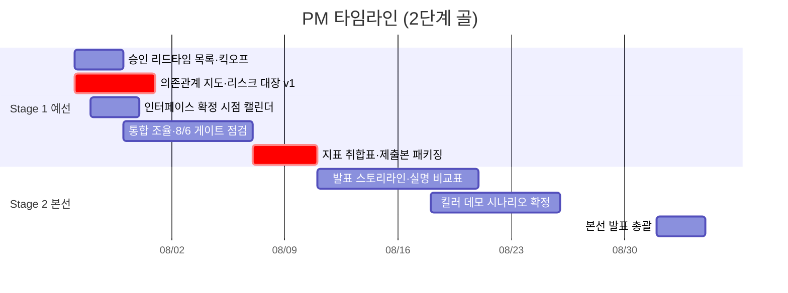

# PM 개별 타임라인

역할 정의: [역할_가이드/01-기획총괄.md](../역할_가이드/01-기획총괄.md) · 전체 흐름: [00-overall.md](00-overall.md) · 2단계 골 프레임: [README.md](README.md)

PM은 산출물을 코드가 아니라 **조율 장치**로 냅니다. 2단계 골 체계에서 PM의 핵심은 (1) 병목 3종(계약·공공 API·알림톡 승인)의 리드타임 추적, (2) 인터페이스 확정 시점 못박기, (3) **Stage 1 Exit Criteria 판정과 8/10 제출본 패키징**, (4) **Stage 2 발표 스토리라인·킬러 데모 총괄**입니다.

## Stage 1 · 예선 통과 (7/27~8/10)

| 서브페이즈 | 작업 | 산출물 / DoD | 선행 대기 | 후행 unblock |
|---|---|---|---|---|
| **S1-1** 7/27~8/2 | 승인·계정 리드타임 목록화·킥오프, 의존관계 지도 v1, 리스크 대장, 인터페이스 확정 시점 캘린더 | 승인 추적표 + 6단계 파이프라인 의존표 + "언제까지 무슨 스키마 확정" 날짜 | Tech Lead 계약 초안 | 전 역할 신청·병렬 착수 |
| **S1-2** 8/3~8/6 | 수직 관통 통합 조율, **8/6 통합 게이트** 점검 | 알림톡·PWA·매칭·RAG가 실데이터로 연결됐는지 체크 | Skeleton, 알림톡 승인 | 실측 착수 |
| **S1-3** 8/7~8/10 | 정량 지표 취합표, **Stage 1 Exit Criteria 판정**, **제출본 패키징·제출(8/10 13:00)** | [S1-E1~E7](00-overall.md#stage-1-exit-criteria--예선-통과-판정) 체크리스트 충족 확인 + 목표 대비 실측값 표 + 제출 완료 | 각 역할 실측치(부분 실측 허용) | 예선 마감 |

**Stage 1 통과 판정 책임**: S1-E1~E7 전항 충족 여부를 QA 검증과 대조해 최종 확인. **부분 실측 원칙**(근거 일치율·도달 속도는 실측, 환각 억제율·명확성은 1차 측정치) 준수 여부를 제출본 서술과 정렬. v4 「진행 현황」서술과 실제 달성분이 어긋나지 않도록 문구 조정.

## Stage 2 · 본선 발표 (8/11~9월 초)

| 서브페이즈 | 작업 | 산출물 / DoD | 선행 대기 | 후행 unblock |
|---|---|---|---|---|
| **S2-1** 8/11~9월 초 | 발표 스토리라인, 안전디딤돌 실명 비교표, 3단계 확산 로드맵, 킬러 데모 시나리오 확정, 리스크 재산정 | [S2-E3~E5](00-overall.md#stage-2-exit-criteria--본선-발표-판정) 충족: 발표 대본 + 실패 모드 대응 시나리오 + 확산 로드맵 자료 | QA 실패 시나리오, AI/RAG 실측값 | 본선 리허설 |
| **S2-2** 9월 초 | 본선 발표·시연 총괄 | 킬러 데모(S2-E1) 발표 완료 | 전 역할 산출물 | — |

**발표 스토리라인 골격**(S2-E4): 문제 정의(도달했으나 행동 전환 실패) → 차별화 3축(정보 vs 행동 결정·정적 vs 개인화 생성·일방향 vs 에이전틱) → B2B/B2G 지속가능성(사용자 무과금) → 3단계 확산 로드맵(능동형/개방형 QR/CBS 연동).

**직접 소관 리스크**: ⑧(일정) 상시, ①②(알림톡·안전) 조기 확인 추적, ⑥⑦(지표 신뢰성) 심사 대응 논리 정리.
**직접 소관 승인**: F(해커톤 행정, 8/10 제출·본선 통보), A·C(리드타임 최장 항목 상태 추적), E(개인정보 — QA와 공동).
