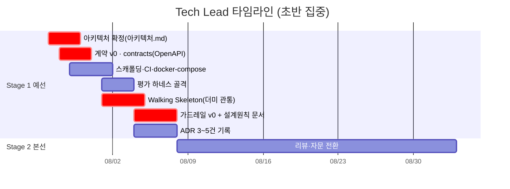

# Tech Lead 개별 타임라인

역할 정의: [역할_가이드/02-테크리드.md](../역할_가이드/02-테크리드.md) · 전체 흐름: [00-overall.md](00-overall.md) · 2단계 골 프레임: [README.md](README.md)

**초반 집중형**입니다(→ [ADR-0002](../adr/0002-frontloaded-tech-lead.md)).
Stage 1 전반에 아키텍처·계약·스캐폴딩·Walking Skeleton·가드레일 v0를 몰아 확정해 나머지 역할을 병렬로 풀어준 뒤, 이후에는 리뷰·자문으로 전환합니다. **계약 v0(`packages/contracts`)가 이 팀 전체의 임계경로 시작점**이므로 S1-1 상반기 내 확정이 최우선입니다.

## Stage 1 · 예선 통과 (7/27~8/10)

| 서브페이즈 | 작업 | 산출물 / DoD | 선행 대기 | 후행 unblock |
|---|---|---|---|---|
| **S1-1 전반** 7/27~7/30 | 아키텍처 확정, **모듈 간 계약 v0** | `packages/contracts`에 OpenAPI·핵심 스키마 v0, 4개 모듈 I/O 확정, **알림 계층 분리**(정형 트리거 ↔ PWA 내부 LLM 코칭) 계약 명문화 | — | **Backend·AI/RAG·Frontend 병렬 착수** |
| **S1-1 후반** 7/29~8/2 | 레포 스캐폴딩·CI·docker-compose·평가 하네스 골격, **`apps/ai-engine` 독립 배포 경계** | `docker-compose up`으로 빈 서비스 기동, CI 통과, ai-engine 자체 Dockerfile·README 뼈대([S1-E5](00-overall.md#stage-1-exit-criteria--예선-통과-판정)) | 저장소 구조(ADR-0001) | 각 역할 로컬 환경 |
| **S1-2** 8/3~8/6 | **Walking Skeleton**, **가드레일 v0** + 설계 원칙 문서, ADR 기록 | 재난 1건이 `수신→매칭→RAG→생성→발송` 관통(더미 허용 → 8/6 실데이터화), 원문 인용 강제·미확보 시 생성거부 규칙 문서화 + 동작 v0([S1-E6](00-overall.md#stage-1-exit-criteria--예선-통과-판정)) | Backend/AI/Frontend 골격 | QA 가드레일 튜닝·검증, 실데이터 통합 |
| **S1-3** 8/7~8/10 | 리뷰·자문 전환, 통합 이슈 대응 | 수직 관통(S1-E1)·독립 배포(S1-E5) 안정, 실측 병목 해소 지원 | 가드레일 v0 안정 | 팀 실측·제출 |

## Stage 2 · 본선 발표 (8/11~9월 초)

| 서브페이즈 | 작업 | 산출물 / DoD | 선행 대기 | 후행 unblock |
|---|---|---|---|---|
| **S2-1~S2-2** 8/11~9월 초 | 리뷰·자문, 통합 이슈 대응 | 오케스트레이션 운영·확장은 AI/RAG, 가드레일 반복 튜닝은 QA가 이어받아 진행. 킬러 데모 아키텍처 안정성 자문 | 가드레일 v0 안정 | 팀 자율 진행 |

**직접 소관 리스크**: ②(안전·가드레일 품질), ③(체인 단계 수 → 지연),
채널 제약(소멸 — 웹푸시 전환으로 슬롯 출력 포맷 요구가 사라졌음, [ADR-0005](../adr/0005-webpush-primary-channel.md)),
⑥⑦(on/off 실험 엄밀성).
**직접 소관 승인**: D(HyperCLOVA X/NCP — 가드레일 v0 구현의 전제, Backend와 공유).
