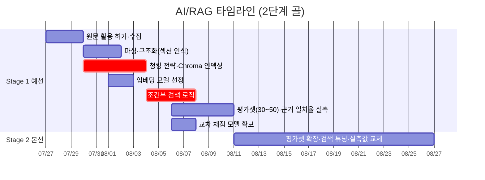

# AI/RAG Engineer 개별 타임라인

역할 정의: [역할_가이드/03-AI-RAG-엔지니어.md](../역할_가이드/03-AI-RAG-엔지니어.md) · 전체 흐름: [00-overall.md](00-overall.md) · 2단계 골 프레임: [README.md](README.md)

모듈 2(RAG)의 실무 구현. 원문 확보 → 청킹·인덱싱 → 조건부 검색 → 근거 일치율 평가 순서로 진행합니다. **청킹·Chroma 인덱싱이 검색 품질과 근거 일치율을 결정**하므로 S1-1 내 완료가 임계경로입니다. 원문 수집·파싱은 Tech Lead 계약을 기다리지 않고 S1-1 첫날부터 선행 가능합니다.

**부분 실측 기준**: Stage 1에서 **근거 일치율은 실측**([S1-E2](00-overall.md#stage-1-exit-criteria--예선-통과-판정)) 대상이며, 통계적 신뢰구간 확보용 평가셋 확장·정식 실측값 교체는 Stage 2([S2-E2](00-overall.md#stage-2-exit-criteria--본선-발표-판정))로 넘깁니다.

## Stage 1 · 예선 통과 (7/27~8/10)

| 서브페이즈 | 작업 | 산출물 / DoD | 선행 대기 | 후행 unblock |
|---|---|---|---|---|
| **S1-1** 7/27~8/2 | 원문 활용 허가 확인·수집(7/27 최우선) → 파싱·구조화, **청킹 전략**, Chroma 인덱싱, 임베딩 모델 선정 | 라이선스(제1~4유형) 확인 원문 세트 + 도메인 청크 경계·오버랩 규칙 + 검색되는 Chroma 인덱스 | — | 검색 로직 |
| **S1-2** 8/3~8/6 | **재난유형+프로필 조건부 검색 로직**, 검색 API | 메타데이터 필터+시맨틱 결합, 계약 스키마대로 근거 문단+출처 반환 | Tech Lead 검색 API 계약 | Walking Skeleton RAG 단계, Tech Lead 오케스트레이션 |
| **S1-3** 8/7~8/10 | **근거 일치율 평가셋(30~50)·채점 스크립트 실측**, 교차 채점 모델 확보 | 재현 가능한 채점 스크립트([S1-E4](00-overall.md#stage-1-exit-criteria--예선-통과-판정)) + **실측 근거 일치율**([S1-E2](00-overall.md#stage-1-exit-criteria--예선-통과-판정)) | 생성 메시지(Tech Lead) | PM 지표 취합, QA 독립 재검증 |

## Stage 2 · 본선 발표 (8/11~9월 초)

| 서브페이즈 | 작업 | 산출물 / DoD | 선행 대기 | 후행 unblock |
|---|---|---|---|---|
| **S2-1~S2-2** 8/11~9월 초 | 평가셋 확장, 검색 튜닝, **정식 실측값 교체** | 신뢰구간 확보용 표본 확대 + 갱신 실측치([S2-E2](00-overall.md#stage-2-exit-criteria--본선-발표-판정)), 지표 발표 지원 | 예선 실측 결과 | 본선 지표 발표 |

**직접 소관 리스크**: ⑥(평가셋 통계적 크기 — Stage 2 확장으로 완화), ⑦(교차 채점 모델 조기 확보), ②(검색 품질 → 잘못된 근거 인용 방지).
**직접 소관 승인**: A(원문 활용 허가 — 코퍼스 선행 조건), D(HyperCLOVA X Embedding — 외부 API 사용 시, 교차 채점 모델 API 한도 포함).
