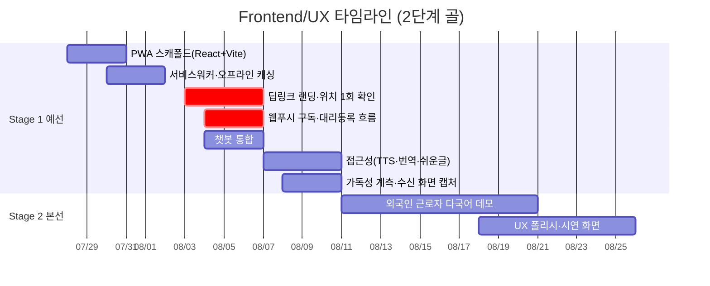

# Frontend/UX 개별 타임라인

역할 정의: [역할_가이드/04-프론트엔드-UX.md](../역할_가이드/04-프론트엔드-UX.md) · 전체 흐름: [00-overall.md](00-overall.md) · 2단계 골 프레임: [README.md](README.md)

모듈 4(무설치 터미널). PWA로 확정(→ [ADR-0004](../adr/0004-pwa-over-native.md)),
스택은 React + Vite + `vite-plugin-pwa`.
PWA 스캐폴드는 계약을 크게 기다리지 않고 S1-1부터 착수 가능합니다.

**외부 심사가 임계경로에서 빠졌습니다.**
1차 채널이 웹푸시(FCM)이고 알림톡은 채택하지 않으므로
(→ [ADR-0005](../adr/0005-webpush-primary-channel.md)),
"템플릿 승인 리드타임"이라는 대기 항목은 **존재하지 않습니다** — 웹푸시에는 발신 전 외부 심사가 없습니다.
대신 추적할 것은 심사가 아니라 **계정·콘솔 작업**입니다:
Firebase 프로젝트 소유권, 앱 config 6종 주입, 재배포, HTTPS 배포처 확보.
승인을 기다리는 항목이 아니라 **우리가 실행하면 끝나는** 항목이라는 점이 일정상 차이입니다.

**문안은 변형 없이 그대로 전달합니다.**
템플릿 슬롯 치환 계층(렌더링 어댑터)은 폐기됐고 재도입하지 않습니다(ADR-0005).
대화형 코칭을 **PWA 내부 LLM 에이전트**가 담당한다는 분리는 그대로 유효합니다.

## Stage 1 · 예선 통과 (7/27~8/10)

| 서브페이즈 | 작업 | 산출물 / DoD | 선행 대기 | 후행 unblock |
|---|---|---|---|---|
| **S1-1** 7/27~8/2 | PWA 스캐폴드, 서비스워커·오프라인 캐싱 | `vite-plugin-pwa` 기반 SW 동작, 오프라인 셸 캐싱 | 스캐폴딩(Tech Lead) | 랜딩 개발 |
| **S1-2** 8/3~8/6 | **딥링크 랜딩(세션 토큰→개인화)·위치 1회 확인**, 웹푸시 구독·대리등록 흐름, 챗봇 통합 | 푸시 딥링크 진입→위치 1회→**문안 무변형** 렌더, 권한 실패 시 행정동 degrade, `/ops`→QR→`/join` 대리등록, 알림/코칭 계층 분리 | 메시지 포맷(Tech Lead), 위치 정보(Backend) | 수직 관통(S1-E1), E2E(QA) |
| **S1-3** 8/7~8/10 | 접근성(TTS·번역·쉬운글), 가독성 계측 훅, **실기기 웹푸시 수신 검증**, **Before/After 실제 수신 화면 캡처** | 쉬운글+음성+원문 대조 UX, **명확성 1차 측정**(치환율·단일행동 로깅, [S1-E3](00-overall.md#stage-1-exit-criteria--예선-통과-판정)), 잠금화면 수신 확인, 캡처 이미지([S1-E7](00-overall.md#stage-1-exit-criteria--예선-통과-판정)) | 생성 메시지 실데이터, **배포본 웹푸시 설정 완료**(HTTPS·앱 config·VAPID·SW·매니페스트) | 명확성 지표(PM/QA), 제출본(PM) |

## Stage 2 · 본선 발표 (8/11~9월 초)

| 서브페이즈 | 작업 | 산출물 / DoD | 선행 대기 | 후행 unblock |
|---|---|---|---|---|
| **S2-1** 8/11~9월 초 | **외국인 근로자 페르소나 다국어 데모**, UX 폴리시, 시연 화면 | 킬러 데모(S2-E1) 페르소나 2 다국어 흐름 완성, 데모용 화면·인터랙션 완성 | 예선 피드백, 번역 API | 본선 시연 |
| **S2-2** 9월 초 | 킬러 데모 시연 | 끊김 없는 단일 흐름 시연 | 전 역할 산출물 | — |

**직접 소관 리스크**: 알림 권한 거부(ADR-0005에 `⚠️ 미해결` — 거부 시 대체 도달 경로 없음),
iOS 웹푸시 제약(16.4+ 및 A2HS, 실기기 검증), ⑥ 중 메시지 명확성(치환율 미달 시 UI 보완).
번호 참조를 피한 이유는 `리스크.md` 재작성이 예정돼 있어서입니다
([이슈 #38](https://github.com/team-savers/savers-project/issues/38)).

**직접 소관 승인**: C(웹푸시 FCM 발신 설정 — **발신 전 외부 심사 없음**, 남은 것은 계정·콘솔 작업),
HTTPS 배포처(→ [ADR-0008](../adr/0008-frontend-static-hosting.md)).
