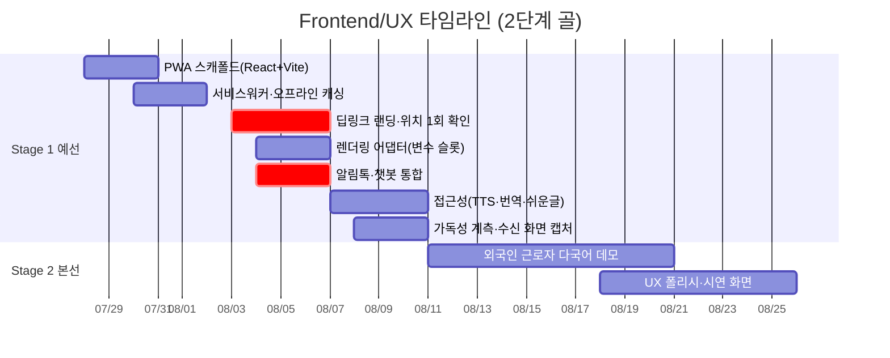

# Frontend/UX 개별 타임라인

역할 정의: [역할_가이드/04-프론트엔드-UX.md](../역할_가이드/04-프론트엔드-UX.md) · 전체 흐름: [00-overall.md](00-overall.md) · 2단계 골 프레임: [README.md](README.md)

모듈 4(무설치 터미널). PWA로 확정(→ [ADR-0004](../adr/0004-pwa-over-native.md)), 스택은 React + Vite + `vite-plugin-pwa`. PWA 스캐폴드는 계약을 크게 기다리지 않고 S1-1부터 착수 가능하지만, **알림톡·챗봇 통합(8/6)은 알림톡 템플릿 승인이라는 최장 리드타임에 묶여** 있어 승인 상태를 초반부터 함께 추적해야 합니다.

**알림 계층 분리 반영**: 알림톡은 사전 승인 **정형 템플릿(변수 슬롯)**, 대화형 코칭은 **PWA 내부 LLM 에이전트**가 담당하도록 렌더링을 분리합니다(v4 확정, [계약 v0](02-테크리드.md) 반영).

## Stage 1 · 예선 통과 (7/27~8/10)

| 서브페이즈 | 작업 | 산출물 / DoD | 선행 대기 | 후행 unblock |
|---|---|---|---|---|
| **S1-1** 7/27~8/2 | PWA 스캐폴드, 서비스워커·오프라인 캐싱 | `vite-plugin-pwa` 기반 SW 동작, 오프라인 셸 캐싱 | 스캐폴딩(Tech Lead) | 랜딩 개발 |
| **S1-2** 8/3~8/6 | **딥링크 랜딩(세션 토큰→개인화)·위치 1회 확인**, 렌더링 어댑터, **알림톡·챗봇 통합** | 알림톡 링크 진입→위치 1회→개인화 렌더, 권한 실패 시 행정동 degrade, 변수 슬롯 매핑, 알림/코칭 계층 분리 | 메시지 포맷(Tech Lead), 위치 정보(Backend), **알림톡 승인** | 수직 관통(S1-E1), E2E(QA) |
| **S1-3** 8/7~8/10 | 접근성(TTS·번역·쉬운글), 가독성 계측 훅, 웹푸시 fallback, **Before/After 실제 수신 화면 캡처** | 쉬운글+음성+원문 대조 UX, **명확성 1차 측정**(치환율·단일행동 로깅, [S1-E3](00-overall.md#stage-1-exit-criteria--예선-통과-판정)), FCM 보조 채널, 캡처 이미지([S1-E7](00-overall.md#stage-1-exit-criteria--예선-통과-판정)) | 생성 메시지 실데이터 | 명확성 지표(PM/QA), 제출본(PM) |

## Stage 2 · 본선 발표 (8/11~9월 초)

| 서브페이즈 | 작업 | 산출물 / DoD | 선행 대기 | 후행 unblock |
|---|---|---|---|---|
| **S2-1** 8/11~9월 초 | **외국인 근로자 페르소나 다국어 데모**, UX 폴리시, 시연 화면 | 킬러 데모(S2-E1) 페르소나 2 다국어 흐름 완성, 데모용 화면·인터랙션 완성 | 예선 피드백, 번역 API | 본선 시연 |
| **S2-2** 9월 초 | 킬러 데모 시연 | 끊김 없는 단일 흐름 시연 | 전 역할 산출물 | — |

**직접 소관 리스크**: ①(알림톡 템플릿 사전승인 — 가장 직접적, S1-1 실확인), iOS PWA 웹푸시 제약(실기기 검증), ⑥ 중 메시지 명확성(치환율 미달 시 UI 보완).
**직접 소관 승인**: C(알림톡 발신 프로필·템플릿 — 렌더링 방식 결정, 신청은 Backend/PM), C(웹푸시 FCM·iOS 16.4+ 제약).
