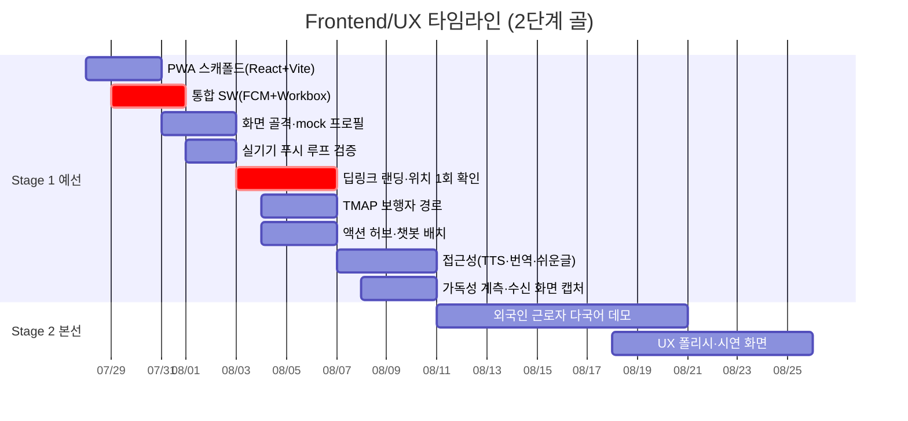

# Frontend/UX 개별 타임라인

> 개정 2026-07-27 — 채널 전환(2026-07-26 팀 결정: 알림톡 폐기 → 웹푸시 1차) 반영.
> **`렌더링 어댑터(변수 슬롯)` 3일 삭제 / S1-2의 선행 대기에서 `알림톡 승인` 제거.**
> 비워진 3일은 여유가 아니라 **통합 서비스워커**와 **TMAP 보행자 경로**로 재배치합니다.

역할 정의: [역할_가이드/04-프론트엔드-UX.md](../역할_가이드/04-프론트엔드-UX.md) · 전체 흐름: [00-overall.md](00-overall.md) · 2단계 골 프레임: [README.md](README.md)

모듈 4(무설치 터미널). PWA로 확정(→ [ADR-0004](../adr/0004-pwa-over-native.md)), 스택은 React + Vite + `vite-plugin-pwa`. **최장 리드타임이던 알림톡 승인이 크리티컬 패스에서 제거되어, 프론트는 외부 승인 대기 없이 S1-1부터 끝까지 자체 진행이 가능합니다.** 대신 새로 생긴 종속은 두 가지입니다 — **① 푸시 발송(Admin SDK) 담당 확정**과 **② HTTPS 배포처**. 둘 다 없으면 "푸시 수신 → 랜딩 진입" 루프를 검증할 수 없습니다.

**알림 계층 정리**: 알림은 **제목+본문+탭 = 랜딩 진입**으로 단순화하고(액션 버튼은 플랫폼별 최대 2개 제한이라 의존하지 않음), 분기와 대화형 코칭은 전부 **PWA 안에서** 수행합니다. 템플릿·변수 슬롯 개념은 사라졌습니다.

## Stage 1 · 예선 통과 (7/27~8/10)

| 서브페이즈 | 작업 | 산출물 / DoD | 선행 대기 | 후행 unblock |
|---|---|---|---|---|
| **S1-1** 7/27~8/2 | PWA 스캐폴드, **통합 서비스워커(FCM `onBackgroundMessage` + Workbox 오프라인 캐싱 단일 SW)**, 화면 골격·mock, 실기기 푸시 루프 | `npm run lint && typecheck && build` 통과 + frontend-ci 그린 / **SW 1개만 등록**(DevTools Application 탭) / 오프라인 앱 셸 로드 / `/demo` → 제스처로 알림 권한 → 푸시 수신 → 탭 → `/a` 진입 / `.env.example` 존재·실키 미커밋 | 스캐폴딩(Tech Lead), **푸시 발송 담당 확정**, **HTTPS 배포처** | 랜딩 개발 |
| **S1-2** 8/3~8/6 | **딥링크 랜딩(세션 토큰→개인화)·위치 1회 확인**, **TMAP 보행자 경로**, 액션 허브, 챗봇 배치 | 알림 탭 진입→(밖이에요일 때만) 위치 1회→개인화 렌더 / 권한 실패 시 **DongPicker 강등** / **어떤 실패 상태에서도 액션 허브 상시 렌더** / 집이에요 경로에서 **GPS 호출 없음** / guardian null 페르소나에서 보호자 버튼 미노출 / 챗봇은 `stage < 3`에서만 | **푸시 페이로드 스키마**·**세션 토큰 계약**(Tech Lead), 위치 정보(Backend), TMAP 키 | 수직 관통(S1-E1), E2E(QA) |
| **S1-3** 8/7~8/10 | 접근성(TTS·번역·쉬운글), 가독성 계측 훅, **Before/After 실제 수신 화면 캡처**, 3단계 분리동의 UI 목업 | 쉬운글+음성+원문 대조 UX / **명확성 1차 측정**(치환율·단일행동 로깅, [S1-E3](00-overall.md#stage-1-exit-criteria--예선-통과-판정)) / 캡처 이미지([S1-E7](00-overall.md#stage-1-exit-criteria--예선-통과-판정)) / 동의 목업(외부승인 E) | 생성 메시지 실데이터, 가독성 지표 정의 합의(QA) | 명확성 지표(PM/QA), 제출본(PM) |

## Stage 2 · 본선 발표 (8/11~9월 초)

| 서브페이즈 | 작업 | 산출물 / DoD | 선행 대기 | 후행 unblock |
|---|---|---|---|---|
| **S2-1** 8/11~9월 초 | **외국인 근로자 페르소나 다국어 데모**, UX 폴리시, 시연 화면 | 킬러 데모(S2-E1) 페르소나 2 다국어 흐름 완성, 데모용 화면·인터랙션 완성 | 예선 피드백, 번역 API | 본선 시연 |
| **S2-2** 9월 초 | 킬러 데모 시연 | 끊김 없는 단일 흐름 시연 | 전 역할 산출물 | — |

## 이번 개정으로 열린 결정 (S1-2 시작 전 확정 필요)

| 결정 | 왜 지금 | 확정 기한 |
|---|---|---|
| **3단계 UI + 보호자 층을 예선 제출본에 반영할지** | mock 스키마·화면 분기가 3단계 전제로 설계되어 있어, 늦게 뒤집히면 mock부터 재작업. 현재는 `STAGE3_ENABLED=false` 플래그로 코드에만 존재 | **8/2** |
| **푸시 발송(Admin SDK) 담당** | 미정이면 S1-1 DoD의 수신 루프를 검증할 수 없음 | 7/28 |
| **HTTPS 배포처(Vercel 등)** | 없으면 안드로이드 실기기 검증 불가. 확정 시 카카오 JS SDK 허용 도메인 추가 등록 필요 | 7/28 |
| **TMAP 키 — 프론트 직접 호출 vs 백엔드 프록시** | 비공개 등급 키. public 저장소라 직접 노출은 보안성 배점에 직결 | 8/2 |
| **2단계 미응답 판정 시간 X분** (30분 제안) | 짧으면 보호자 오탐, 길면 골든타임 손실 | 8/3 |

**직접 소관 리스크**: iOS 웹푸시 제약(알림톡 폐기로 **우회 수단 소멸 — 승격됨**, 실기기 검증), 알림 권한 거부(신규 실패 모드), HTTPS 배포 의존, ⑥ 중 메시지 명확성(치환율 미달 시 UI 보완).
**직접 소관 승인**: C(웹푸시 FCM — 통합 SW·HTTPS 배포처), B(TMAP·카카오 JS 도메인), F(키 등급 구분). ~~C(알림톡 발신 프로필·템플릿)~~ 폐기.
