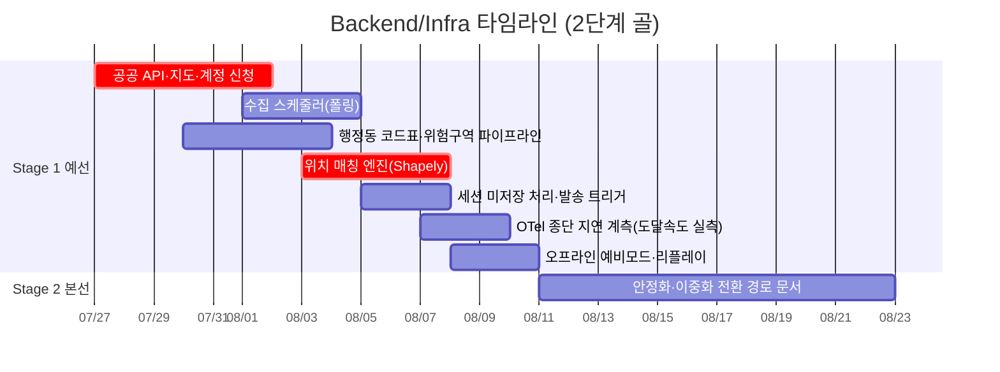

# Backend/Infra 개별 타임라인

역할 정의: [역할_가이드/05-백엔드-인프라.md](../역할_가이드/05-백엔드-인프라.md) · 전체 흐름: [00-overall.md](00-overall.md) · 2단계 골 프레임: [README.md](README.md)

모듈 1(위치 매칭 엔진) + 인프라. **공공 API 승인이 리드타임 최장**이므로 7/27 즉시 신청이 최우선이며(심사 수일), 승인 지연 시 더미/캐시 데이터로 매칭 엔진을 병렬 개발하는 우회로를 준비합니다. 위치 매칭 엔진은 수직 관통(8/6)의 핵심 입력이라 임계경로입니다.

**부분 실측 기준**: Stage 1에서 **알림 도달 속도(p95)는 실측**([S1-E2](00-overall.md#stage-1-exit-criteria--예선-통과-판정)) 대상이며, OTel 종단 스팬으로 `API 수신→발송` 구간을 자동 측정합니다.

## Stage 1 · 예선 통과 (7/27~8/10)

| 서브페이즈 | 작업 | 산출물 / DoD | 선행 대기 | 후행 unblock |
|---|---|---|---|---|
| **S1-1** 7/27~8/2 | **공공 API 3종·카카오맵·NCP/AWS 계정 신청(7/27 즉시)**, 수집 스케줄러, 행정동 코드표 적재, 위험구역 데이터 파이프라인 | 신청 접수 완료 + 폴링 동작(승인 전엔 더미) + 코드표·위험구역 GIS 적재 | API 승인(우회: 더미), 계약(Tech Lead) | 매칭 엔진 |
| **S1-2** 8/3~8/6 | **위치 매칭 엔진(Shapely point-in-polygon)**, 세션 미저장 처리, 발송 트리거 API | 행정동+좌표 위험구역 판정, 위치 원본 미저장 코드 강제([S1-E6](00-overall.md#stage-1-exit-criteria--예선-통과-판정)), 발송 트리거 노출 | 위험구역 데이터, 카카오맵 키 | Skeleton, Frontend 위치 표시, Tech Lead 검색 조건 |
| **S1-3** 8/7~8/10 | **OTel 종단 지연 계측(p95) 실측**, 오프라인 예비모드, 재난 이력 리플레이 지원 | 수신→발송 스팬 연결로 **p95 실측**([S1-E2](00-overall.md#stage-1-exit-criteria--예선-통과-판정)), 캐시 전환 트리거, 리플레이 실행 | 수직 관통 완료 | PM 지연시간 지표, QA E2E |

## Stage 2 · 본선 발표 (8/11~9월 초)

| 서브페이즈 | 작업 | 산출물 / DoD | 선행 대기 | 후행 unblock |
|---|---|---|---|---|
| **S2-1~S2-2** 8/11~9월 초 | 안정화, 이중화 전환 경로 README 1줄 문서화, 인프라 데모 지원 | 킬러 데모 안정 + 확장 경로 명시(→ [ADR-0003](../adr/0003-single-vm-seoul.md)) | 예선 피드백 | 본선 데모 |

**직접 소관 리스크**: ④(공공 API 의존성 — 가장 직접적), ⑤(위치 정밀도·행정동 경계), ③(위치·매칭이 지연 예산 앞부분), ⑨(위치·장애 여부 암호화·미저장).
**직접 소관 승인**: A(공공 Open API 3종 — 별도 신청, 리드타임 최장), B(카카오맵·행정동 코드표), D(AWS 계정·크레딧, NCP는 Tech Lead/AI-RAG와 공유).
