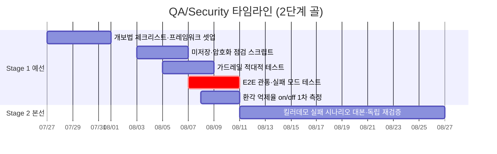

# QA/Security 개별 타임라인

역할 정의: [역할_가이드/06-QA-보안.md](../역할_가이드/06-QA-보안.md) · 전체 흐름: [00-overall.md](00-overall.md) · 2단계 골 프레임: [README.md](README.md)

다른 5개 역할 산출물이 설계 원칙([CLAUDE.md](../../CLAUDE.md) 비타협 제약)을 실제로 지키는지 검증하는 역할. 타임라인상 QA는 **검증 대상이 존재한 뒤**에 밀도가 올라가므로 S1-2부터 본격화하되, 프레임워크·체크리스트 셋업은 S1-1에 선행합니다. **E2E·실패 시나리오가 Stage 1 제출 직전 임계경로**이며, QA는 **Stage 1 Exit Criteria 검증의 실무 주체**(판정은 PM)입니다.

**부분 실측 기준**: Stage 1에서 **환각 억제율은 1차 측정치**([S1-E3](00-overall.md#stage-1-exit-criteria--예선-통과-판정))로 제출하고, 생성 모델과 다른 방식의 독립 재검증·정식 실측은 Stage 2로 이어집니다.

## Stage 1 · 예선 통과 (7/27~8/10)

| 서브페이즈 | 작업 | 산출물 / DoD | 선행 대기 | 후행 unblock |
|---|---|---|---|---|
| **S1-1** 7/27~8/2 | 개인정보보호위 체크리스트 확보, 테스트 프레임워크(pytest/Playwright) 셋업 | 점검 계획 + 빈 테스트 하네스 CI 연결 | 스캐폴딩(Tech Lead) | 점검 스크립트 |
| **S1-2** 8/3~8/6 | **미저장·암호화 점검 스크립트**, 가드레일 적대적 테스트 | 로그·DB에 위치 원본 좌표 부재 자동 확인([S1-E6](00-overall.md#stage-1-exit-criteria--예선-통과-판정)), 명령어 주입·원문 외 생성 차단 검증 | 미저장 구현(Backend), 가드레일 v0(Tech Lead) | Backend/Tech Lead 피드백 |
| **S1-3** 8/7~8/10 | **E2E 관통 테스트(실패 모드 포함)**, 환각 억제율 on/off **1차 측정**, **Stage 1 Exit Criteria 검증** | 등록→감지→매칭→위치→생성→발송 관통([S1-E1](00-overall.md#stage-1-exit-criteria--예선-통과-판정)) + API장애·위치실패·가드레일이탈 케이스 + 환각 억제율 1차 측정치([S1-E3](00-overall.md#stage-1-exit-criteria--예선-통과-판정)) + Exit Criteria 체크 결과 | 수직 관통, 근거 일치율 스크립트(AI/RAG) | PM Stage 1 통과 판정 |

## Stage 2 · 본선 발표 (8/11~9월 초)

| 서브페이즈 | 작업 | 산출물 / DoD | 선행 대기 | 후행 unblock |
|---|---|---|---|---|
| **S2-1** 8/11~9월 초 | **킬러 데모 실패 시나리오 시연 대본**, 환각 억제율 정식 재검증(독립) | 성공만이 아니라 안전장치 작동을 보여주는 대본([S2-E3](00-overall.md#stage-2-exit-criteria--본선-발표-판정), [리스크.md](../공통_가이드/리스크.md) ②), 생성 모델과 다른 방식 독립 재검증 | 예선 결과, AI/RAG 확장 실측 | 본선 시연(PM) |
| **S2-2** 9월 초 | 시연 중 안전장치 시연 지원 | 실패 모드 데모 | — | — |

**직접 소관 리스크**: ②(안전 오작동 — 실패 모드 사전 발견·정직한 시연),
⑨(암호화·최소수집 최종 검증), ⑥⑦(생성 모델과 다른 방식의 독립 재검증),
1차 채널 웹푸시의 실패 모드(알림 권한 거부·iOS A2HS 미충족·FCM 토큰 미등록 —
[ADR-0005](../adr/0005-webpush-primary-channel.md)에 `⚠️ 미해결`).
번호 참조를 피한 이유는 `리스크.md` 재작성이 예정돼 있어서입니다
([이슈 #38](https://github.com/team-savers/savers-project/issues/38)).
**직접 소관 승인**: E(개인정보/법적 — 동의 문구·처리방침 구현 검증, 수립은 PM과 공동),
C(웹푸시 FCM — 발신 전 외부 심사가 없어 승인 대기가 아니라
배포본이 알림을 받을 수 있는 상태인지 점검하고, 권한 거부·iOS A2HS 경로를 함께 확인. Frontend와 공유).
